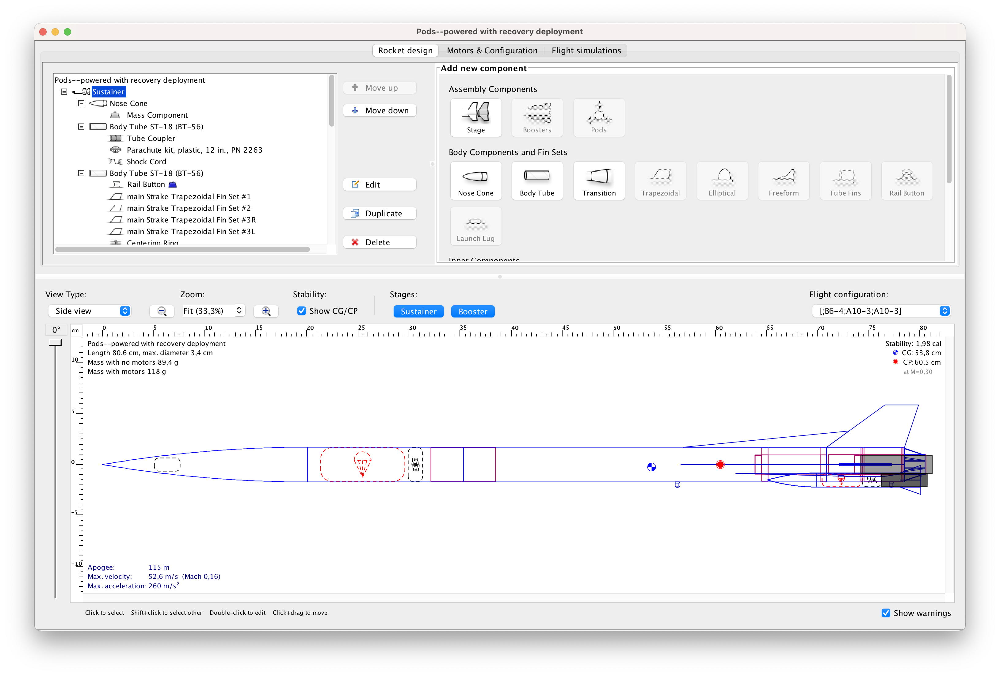
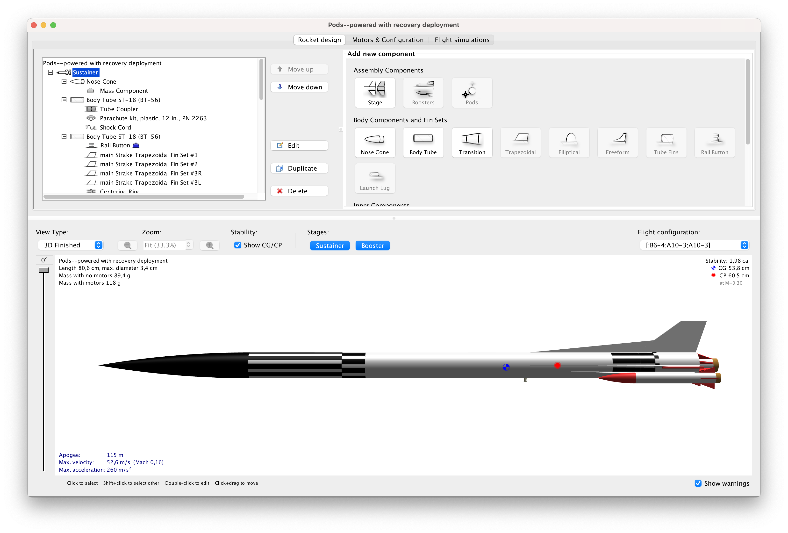
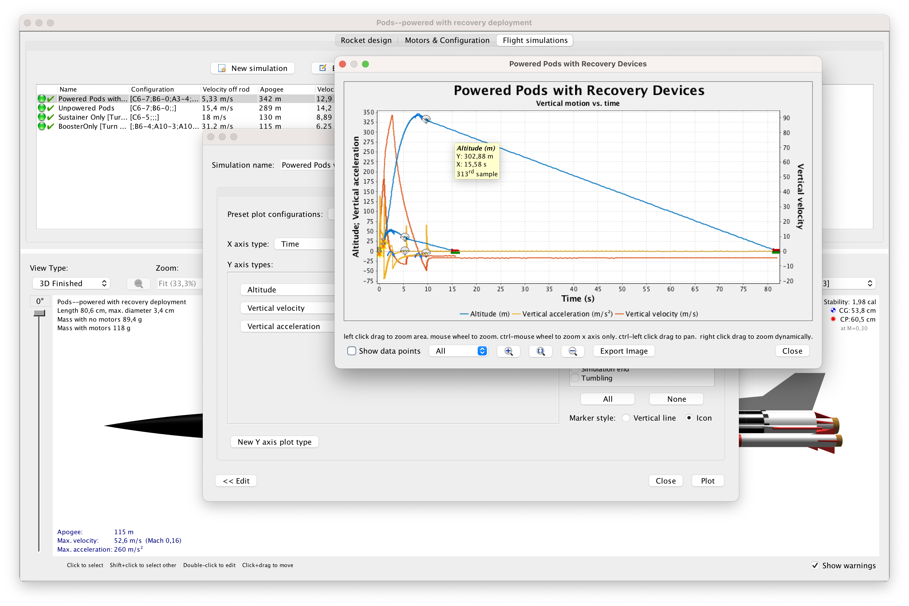
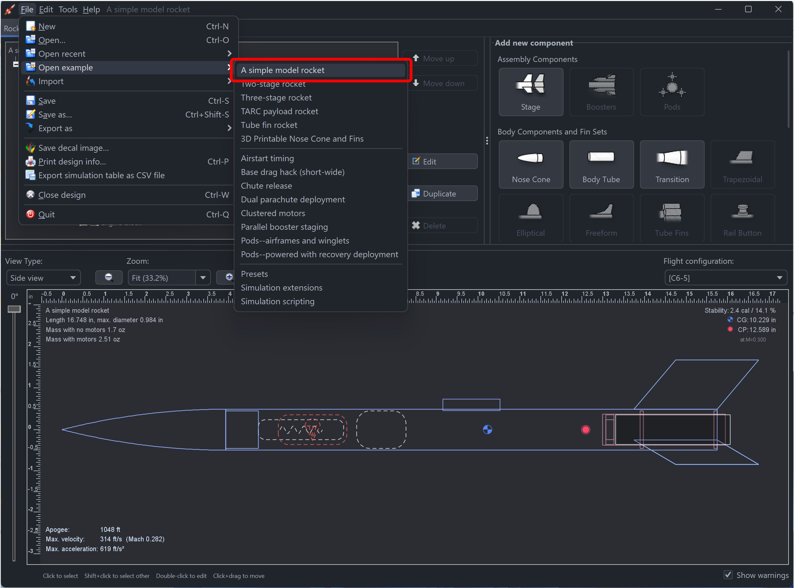

project_rock-it is a free, fully featured model rocket simulator that allows you to design and simulate your rockets before actually building and flying them.

--------

## 🛠️ Design, Visualize, and Analyze

1. **Design** your rockets using a rich selection of built-in components:
   

2. **Visualize** your masterpiece in 3D:
   

3. **Plot & Analyze** your simulation results for precision and improvements:
   

## 🌟 Features

- **Six-degree-of-freedom flight simulation**
- **Automatic design optimization**
- **Realtime simulated altitude, velocity, and acceleration display**
- **Staging and clustering support**
- **Export to other simulation programs (RockSim, RASAero II)**
- **Export component(s) to OBJ file for 3D printing or SVG for laser cutting**
- **Cross-platform (Java-based)**

... plus many more

## 🚀 Getting started

The easiest way to get familiar with project_rock-it is to open one of our in-program example designs:

Dive into the essentials: adjust component dimensions, plot a simulation, swap out motors, and more. Explore the impact of your changes and, most importantly, enjoy the process! 😊

---

